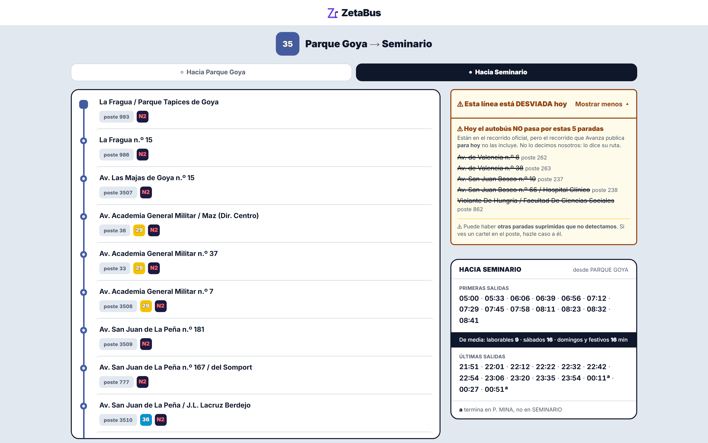
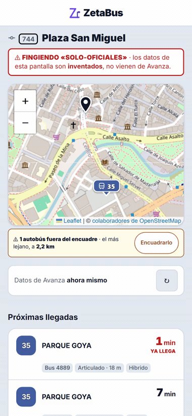
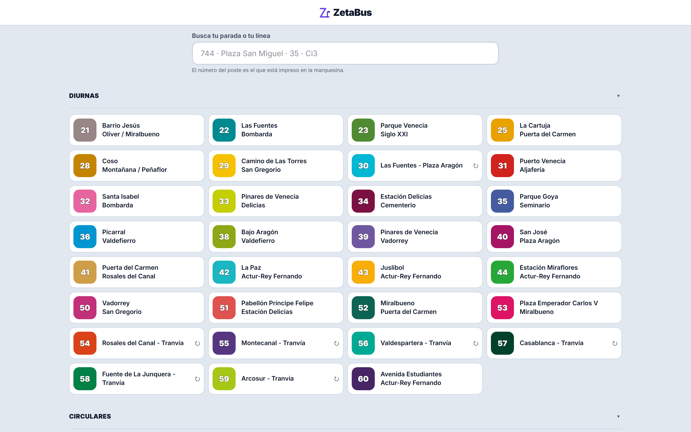
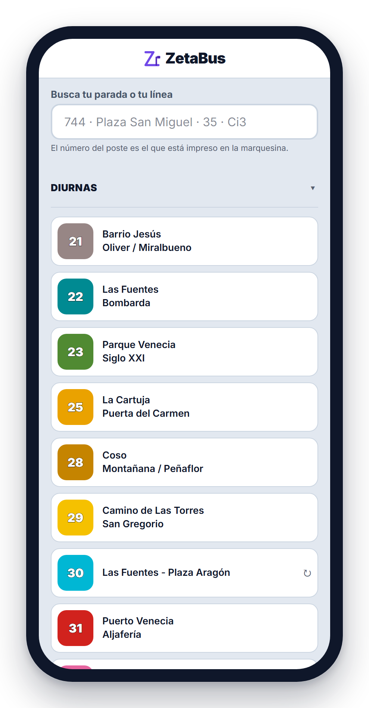
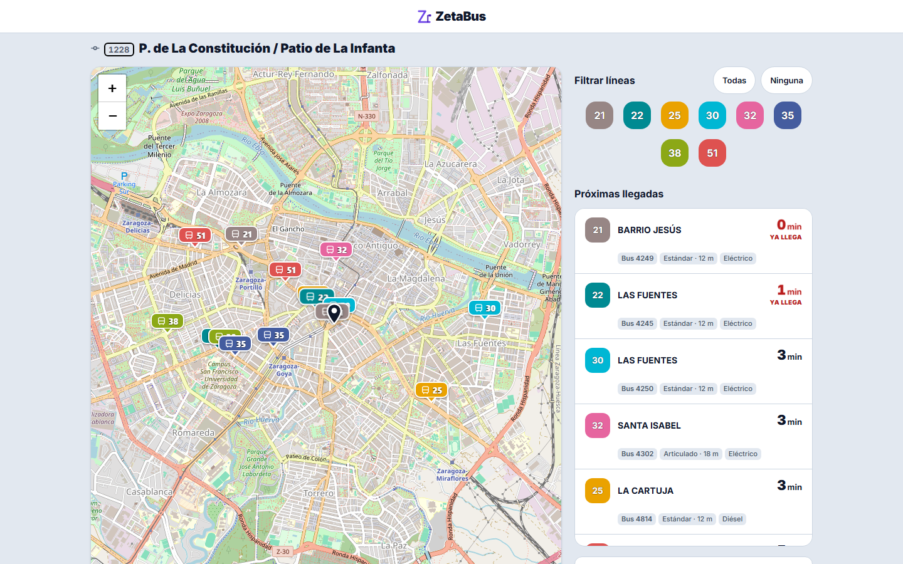
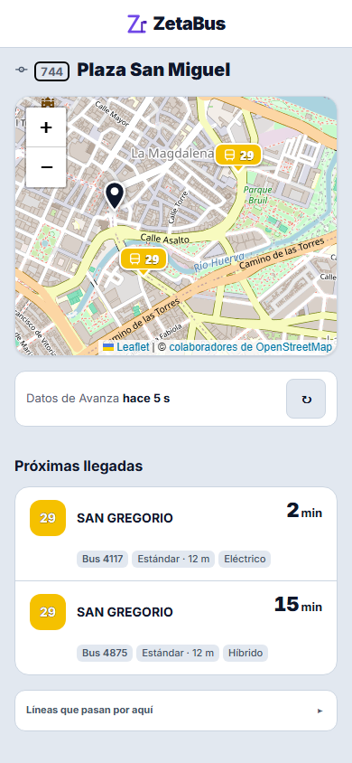
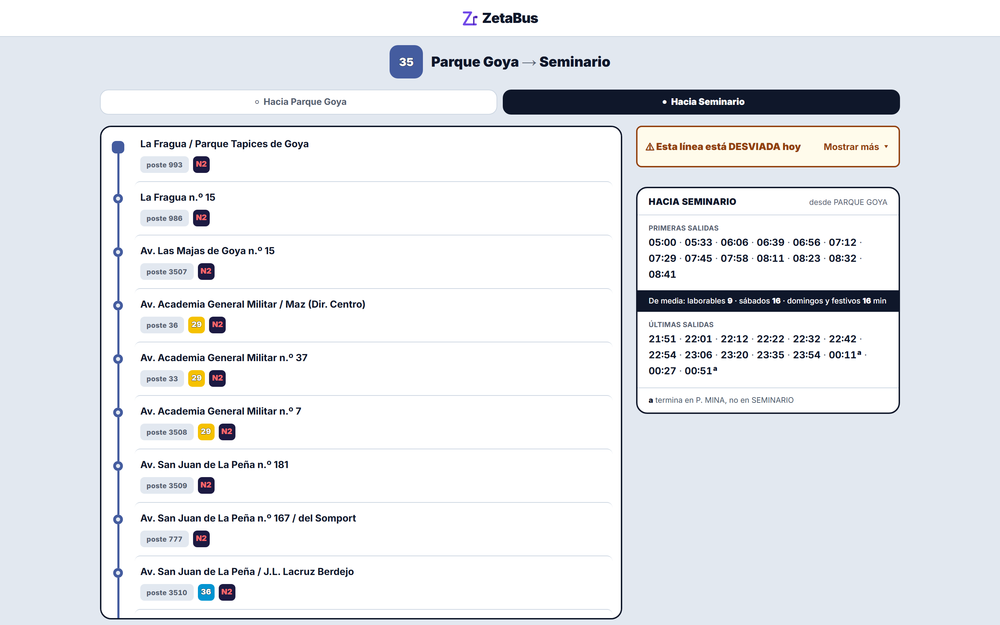
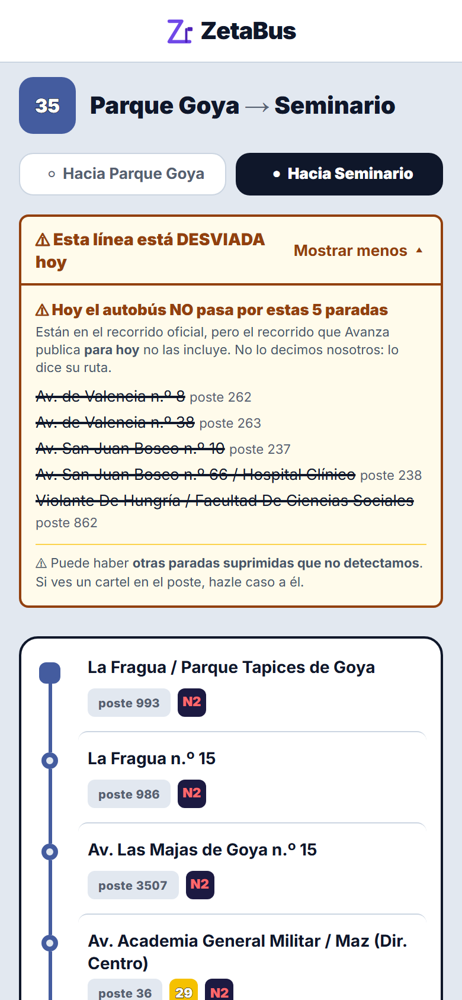

<div align="center">


# ZetaBus

**Dónde está tu autobús en Zaragoza, cuánto falta, y qué te están ocultando las fuentes.**

[](CHANGELOG.md)
[](LICENSE)
[](https://nextjs.org/)
[](https://www.typescriptlang.org/)
[](https://leafletjs.com/)
[](#sin-base-de-datos-es-una-decisión)

**44 líneas · 934 paradas · sin base de datos · sin cuentas · sin cookies**

</div>

<div align="center">

### 🚌 Verlo funcionando → **[zetabus.antonioblanquez.es](https://zetabus.antonioblanquez.es)**

</div>

> **No hay nada que instalar y no es una demo con datos de mentira: son los autobuses que hay
> ahora mismo en la calle.** Busca tu parada por el número del poste, o mira una línea con su
> recorrido de hoy.
>
> 🕐 **La hora importa, y no es un fallo.** De madrugada casi no hay servicio, así que una parada
> puede salir sin llegadas: eso **es** la respuesta correcta —ZetaBus no inventa un autobús que no
> viene—. Y el aviso de desvío solo aparece en las líneas que hoy tengan obras: el día que Avanza
> restaure la ruta, **se apaga solo**.
>
> Para levantarlo en tu máquina, dos comandos → [**Poner en marcha**](#poner-en-marcha).

---

## Qué es ZetaBus

**ZetaBus dice cuánto falta para que llegue tu autobús en Zaragoza**, dónde está exactamente
ahora mismo en el mapa, y **qué autobús es**: si es articulado de 18 metros o sencillo de 12, si
es eléctrico, híbrido o diésel.

Y hace una cosa más, que es la razón de que exista: **enseña lo que las fuentes oficiales no
cuentan.** Cuando hay obras, el GTFS oficial de la ciudad **sigue diciendo que el autobús pasa por
una avenida cortada**. ZetaBus compara ese recorrido oficial con el que el operador publica *para
hoy*, y **deduce el desvío** — con las paradas por las que hoy no se pasa, tachadas y con su
fuente al lado. No lo transcribe nadie a mano: **se deriva, y por eso se apaga solo** el día que
restauren la ruta.

¿Prefieres verlo antes de leer nada más? Está en vivo en
**[zetabus.antonioblanquez.es](https://zetabus.antonioblanquez.es)**.

<div align="center">

<br><em>La línea 35, hoy. <strong>Las cinco paradas tachadas no las publica ninguna fuente como suprimidas</strong>: salen de comparar el recorrido oficial con el que Avanza publica para hoy. Y ZetaBus dice de dónde lo saca — y hasta dónde no llega.</em>
</div>

---

## Por qué existe

En Zaragoza **no hay GTFS-RT**. No es que no lo hayamos encontrado: **no existe**, verificado
contra el Punto de Acceso Nacional, Transitland y Mobility Database. Ésa es la razón —y la
única— por la que en este proyecto hay *scraping*.

Pero el problema de fondo no es que falte una API. Es que **las fuentes que sí existen se
contradicen, y nadie lo dice**:

- **El GTFS oficial da la topología, y miente cuando hay obras.** Cero `exception_type=2` en
  `calendar_dates`. Sus rutas siguen bajando por calles cortadas. Su `shapes.txt` es **preciso y
  falso**.
- **El recorrido REAL de hoy está en la web del operador**, en un endpoint de su WordPress: la
  secuencia ordenada de paradas del recorrido vigente, por sentido, con el desvío ya aplicado.
- **Y hay algo que no refleja ninguna fuente:** cuando el autobús *pasa pero no para*, la ruta
  operativa no cambia. El GTFS lista esa parada, la web la lista, y **el sistema de tiempo real
  sigue anunciando autobuses en un poste suprimido**. No hay base de datos en el mundo que diga la
  verdad sobre esa parada. **Solo un cartel en la marquesina.**

> Ante eso ZetaBus **no adjudica**. Enseña los dos hechos y quién los dice:
> *«Avanza declaró esta parada suprimida el 10/01. Su sistema sigue anunciando autobuses aquí. No
> podemos saber cuál es cierto — confírmalo en la marquesina.»*

Esa es la diferencia entre esto y un *scraper* con un mapa encima: **primero se auditó la fuente,
después se escribió el código.** Los informes están en [`docs/auditoria/`](docs/auditoria/) — trece,
incluidos **los tres en que hubo que retractarse de un informe propio**.

<div align="center">

<br><em><strong>Cuando el operador no responde, ZetaBus lo dice</strong> — en vez de inventar un autobús o dejar la pantalla en blanco. <br>(Estado <strong>simulado</strong> con <code>?fingir=caido</code>; la banda roja es el propio aviso de demo de la app.)</em>
</div>

---

## Capturas

### Buscar

<table>
  <tr>
    <td width="62%">
      
      <p align="center"><em>Las <strong>44 líneas</strong>, agrupadas por tipo: diurnas, circulares, lanzaderas y búhos.</em></p>
    </td>
    <td width="38%">
      
      <p align="center"><em>En el móvil, que es donde se usa.</em></p>
    </td>
  </tr>
</table>

> El buscador encuentra por **número de poste** —el que está impreso en la marquesina—, por nombre
> de parada o por línea. Y encuentra igual escribiendo «avda», «Av.» o «Avenida», con acentos o
> sin ellos, y hasta «Carlos Quinto» para «Carlos V».

### La parada: cuánto falta, y qué autobús es

<div align="center">

<br><em>Once autobuses en vivo, con su <strong>coordenada GPS real</strong>. De cada uno: modelo, longitud —<strong>articulado de 18 m o sencillo de 12</strong>— y combustible. La lista y el mapa están sincronizados: pulsa un autobús y se aísla en los dos.</em>
</div>

<table>
  <tr>
    <td width="42%">
      
      <p align="center"><em>⭐ <strong>Lo primero que se ve es el dato.</strong> No un botón de guardar, no el mapa: los minutos.</em></p>
    </td>
    <td width="58%">
      
      <p align="center"><em>La línea: recorrido en orden, transbordos en cada parada, y las <strong>primeras y últimas salidas</strong> con la frecuencia media.</em></p>
    </td>
  </tr>
</table>

### Y el desvío, también en el móvil

<div align="center">

<br><em>Con la frase que resume el proyecto entero: <strong>«No lo decimos nosotros: lo dice su ruta.»</strong> Y debajo, sus propios límites: <em>«Puede haber otras paradas suprimidas que no detectamos.»</em></em>
</div>

---

## Características

**Lo que ves al abrir una parada**
- Los **minutos que faltan**, arriba del todo. El mapa va debajo, siempre.
- Cada autobús con su **posición GPS real**, no interpolada.
- **Qué vehículo es**: modelo, longitud (articulado / sencillo) y combustible.
- **Filtro por línea** y selección cruzada: pulsa en el mapa y su fila viene a ti.
- **La edad del dato, a la vista**: «Datos de Avanza hace 6 s». Nunca se disimula.

**Lo que ves al abrir una línea**
- El **recorrido real de hoy**, en orden, con las obras ya aplicadas.
- **Los transbordos** en cada parada: qué otras líneas pasan por ahí.
- **Primeras y últimas salidas** por sentido, y la frecuencia media.
- **El desvío, si lo hay**, con las paradas suprimidas tachadas y su procedencia.

**Lo que ZetaBus no hace**
- **No adivina.** Si un dato no está, dice que no está — nunca un valor por defecto.
- **No adjudica.** Cuando dos fuentes se contradicen, enseña las dos y quién las dice.
- **No pide nada.** Sin cuentas, sin registro, sin cookies propias, sin analítica.

**Accesibilidad, y medida**
- Ningún estado se comunica **solo con el color**: siempre hay forma o palabra. (Y hay motivo:
  **22 de las 44 líneas** caen en la franja rojo/ámbar/verde, y la 31 es literalmente el mismo
  rojo que «retraso».)
- El número de cada línea se lee **sobre cualquier color de fondo**, garantizado por contraste
  calculado, no elegido a ojo.
- Zonas táctiles, contraste y navegación por teclado **verificados sobre la pantalla pintada**,
  no sobre el CSS declarado.

---

## Las fuentes, y qué se hace con cada una

| Fuente | Qué aporta | Qué **no** |
|---|---|---|
| **GTFS del Punto de Acceso Nacional** | Topología: paradas, líneas, trazados, calendario | Miente con las obras. No tiene tiempo real |
| **Web del operador** (recorrido) | El recorrido **vigente hoy**, por sentido, con el desvío aplicado | No dice que sea un desvío: hay que **derivarlo** |
| **Sistema de tiempo real del operador** | Posición GPS y minutos de llegada | Anuncia autobuses en paradas suprimidas |
| **Pliego municipal de contratación** | El registro oficial de la flota: **350 vehículos** | Se aprobó en 2025: no trae los posteriores |
| **busesmadrid.es** | Los **43 vehículos** que circulan y no están en el pliego | No es oficial → salen **marcados con asterisco** |
| **OpenStreetMap** | La cartografía | — |

Las dos fuentes principales dan 393; con algunas fuentes menores se llega a
los **403 vehículos** que ZetaBus reconoce, y cada ficha dice **de qué fuente sale cada
uno de sus campos** — no el vehículo entero: el campo. Un coche del pliego con una longitud
observada a mano no se blanquea por el resto.

> Y una que salió por sorpresa: gracias al pliego municipal descubrimos que el fichero de flota
> heredado **mentía en el 20 % de las longitudes** —decía «12 metros» donde había un articulado de
> 18—. Un Volvo 7905 existe en las dos longitudes, **con el mismo nombre de modelo**.

⚖️ Cada dato lleva **de dónde sale** hasta la pantalla: [`/sobre-los-datos`](src/app/sobre-los-datos)
lo explica dentro de la propia aplicación.

---

## Sobre el *scraping* — sin esconderlo

**ZetaBus consulta endpoints no documentados del operador.** No lo escondemos, y no nos parece que
haya que esconderlo: **lo justificamos.**

- **No hay API pública, y se verificó que no existe** contra tres registros independientes.
- **Se consume, no se redistribuye.** No hay ni un byte de datos raspados en este repositorio.
  Consumir un endpoint es ser un cliente de su web; republicarlo sería otra cosa muy distinta.
- **Se pide con techo y con cortesía:** caché compartida en servidor (10 personas en la misma
  parada = **1 petición**, no 10), límite duro de peticiones por segundo, tiempo de espera,
  cortacircuitos, y **cero peticiones cuando nadie está mirando**.
- **Vamos identificados.** Cada petición lleva `ZetaBus/1.0 (+https://github.com/ablanquez/zetabus)`:
  nombre, versión y la URL de este repositorio, donde está explicado todo y quién lo firma. Si
  molestamos, queremos que puedan pedirnos que paremos **antes** de tener que bloquearnos.
- **Y el `robots.txt` no indexa las paradas** — ni por cortesía ni por ahorro: porque los minutos
  que faltan **caducan en 15 segundos**, y una parada indexada enseñaría un «llega en 3 min» de
  hace tres semanas.

---

## Stack tecnológico

| Capa | Tecnología |
|---|---|
| **Framework** | [Next.js 16](https://nextjs.org/) (App Router) · React 19 |
| **Lenguaje** | **TypeScript** en modo estricto |
| **Mapa** | [Leaflet](https://leafletjs.com/) + [OpenStreetMap](https://www.openstreetmap.org/) |
| **Estilos** | Tailwind CSS 4, sobre un sistema de *tokens* propio |
| **Datos** | GTFS horneado en el *build* · **sin base de datos** |
| **Pruebas** | [Vitest](https://vitest.dev/) (motor) + [Playwright](https://playwright.dev/) (pantalla) |

### Sin base de datos: es una decisión

*No es una carencia.* Todo lo que ZetaBus enseña **se deriva** de sus fuentes, y lo derivable no se
guarda. El día que se quiera **medir** —frecuencia real contra frecuencia contratada— hará falta
histórico, y ese día se decide entonces, con los ojos abiertos.

```
src/
  core/        el vocabulario del dominio. No sabe que esto son autobuses.
  sources/     todo lo que habla con el mundo. Un ÚNICO punto de salida a la red.
  engine/      la lógica: llegadas, desvíos, horarios, correspondencias, búsqueda.
  cache/       caché de dos pisos (memoria + disco), vuelo único y techo de peticiones.
  components/  la interfaz.
  app/         las rutas.
scripts/       los compiladores de datos: GTFS → artefacto, flota, correspondencias.
tests/         el motor, con dobles. No toca la red.
e2e/           el instrumento: mide LA PANTALLA, no el código.
docs/          la auditoría de fuentes y las decisiones de diseño.
```

---

## Poner en marcha

### Requisitos

- **Node.js 20.9** o superior.
- Una **ApiKey del Punto de Acceso Nacional** (registro gratuito, se emite al instante) para
  descargar el GTFS.

### Pasos

```bash
git clone https://github.com/ablanquez/zetabus
cd zetabus
npm install

cp .env.example .env.local     # y pon dentro tu NAP_API_KEY
npm run gtfs:fetch             # descarga el GTFS oficial (~6,6 MB)

npm run dev                    # http://localhost:3000
```

**El GTFS no viene en el repositorio.** El porqué —que no es legal, es de frescura— está en
[`data/gtfs/README.md`](data/gtfs/README.md). Y **el *build* falla ruidosamente si no está**: no
arranca con datos vacíos, porque un mapa sin paradas que no se queja es peor que un error.

### El índice de correspondencias

Para cada poste, qué líneas pasan hoy — separando las de siempre de las que hoy pasan **por un
desvío**. Se genera solo con `npm run build`, y si el operador está caído durante el *build*,
**el build no se muere**: la aplicación arranca en modo degradado y lo dice.

```bash
npm run correspondencias:build   # regenerarlo a mano (~2 min)
```

En un hosting **sin SSH** no se puede lanzar ese comando, así que el mismo barrido —el mismo
código, no una copia— se dispara con `POST /api/regenerar`, protegido por un token en cabecera.
Si el token no está configurado en el servidor, **el endpoint no ejecuta nada**: responde `503`.
Ver [`.env.example`](.env.example).

### Ver cómo funciona sin tocar la red

```bash
ZETABUS_DEMO=1 npm run dev
# y luego:  /parada/744?fingir=caido   ·   /linea/35?sentido=0&fingir=desviada
```

`?fingir=` **intercepta todas las peticiones**: cero bytes hacia el operador. Sirve para ver los
casos raros —fuente caída, respuesta ilegible, línea desviada— sin esperar a que ocurran.

---

## Cómo está construido

Tres cosas que no se ven en las capturas y explican el resto:

**1 · La auditoría vino antes que el código.** Siete fases de investigación de fuentes, con sus
informes en [`docs/auditoria/`](docs/auditoria/), **antes** de escribir la aplicación. Tres de
ellos son retractaciones de un informe anterior propio.

**2 · Las pruebas miran la pantalla, no el código.** Más de **470** pruebas de motor (Vitest) y más
de **800** de navegador (Playwright) —dicho como suelo, y a propósito: contarlas exactas exige
correr las dos suites, así que ningún guardián puede vigilar esa cifra y un número redondo se
quedaría rancio en silencio—. Las visuales **miden el píxel pintado**, no la clase de CSS. El motivo
está escrito en [`e2e/lib/medir.ts`](e2e/lib/medir.ts): *«verificar el JSON con `curl` NO ES haber
mirado la pantalla»*.

**3 · Lo que se descubre se escribe, aunque duela.** Cada informe de auditoría trae una sección de
lo que **no** se pudo comprobar, y las lecciones de método están en
[`docs/LECCIONES.md`](docs/LECCIONES.md) — incluidas las que se aprendieron equivocándose.

---

## Hoja de ruta

✅ **Hoy:** llegadas en vivo con posición GPS, ficha de vehículo, recorrido real con desvíos
derivados, horarios de terminal, transbordos por parada, buscador, panel de estado del propio
servicio (cuánto se le pide al operador y con qué frescura), modo demo — y **en marcha en
[zetabus.antonioblanquez.es](https://zetabus.antonioblanquez.es)**. Todo lo que incluye esta
primera versión está en el [**CHANGELOG**](CHANGELOG.md).

Previsto, sin fechas comprometidas:

- **Avisos de parada suprimida** en la vista de parada, no solo en la de línea.
- **Tranvía.** El núcleo ya está preparado para ser multimodal, y hay una prueba que lo vigila.

---

## Licencia y créditos

Código: **[Apache 2.0](LICENSE)** · © 2026 **Antonio Blánquez Cabeza** —
[antonioblanquez.es](https://antonioblanquez.es)

Los datos y las dependencias de terceros conservan sus propias condiciones, una por una, en
**[`THIRD-PARTY-NOTICES.md`](THIRD-PARTY-NOTICES.md)**.

> ⚠️ Una de ellas no es como las demás: **`react-leaflet` está bajo
> [Hippocratic 2.1](https://firstdonoharm.dev/version/2/1/license/)**, que **no es una licencia
> aprobada por la OSI** y añade una restricción de uso que Apache 2.0 no impone. No impide nada,
> pero conviene saberlo antes de tomar este código:
> [`THIRD-PARTY-NOTICES.md` § 5.2](THIRD-PARTY-NOTICES.md).

Datos de transporte procesados a partir del GTFS publicado por Avanza Zaragoza S.A.U. en el Punto
de Acceso Nacional. **Powered by [MITRAMS](https://www.transportes.gob.es/).**
Cartografía © [colaboradores de OpenStreetMap](https://www.openstreetmap.org/copyright).

**No es un producto oficial de Avanza Zaragoza ni del Ayuntamiento de Zaragoza.**
