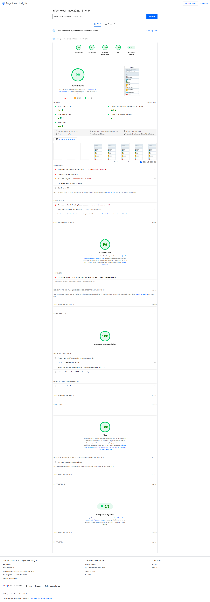
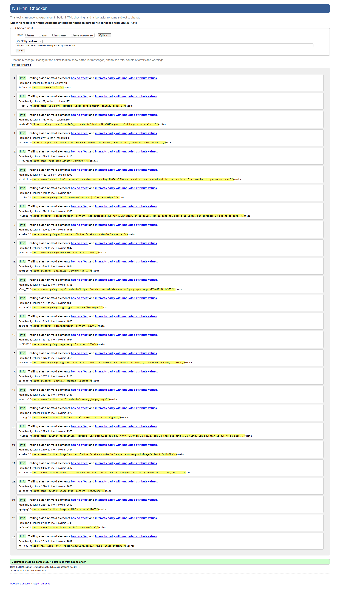
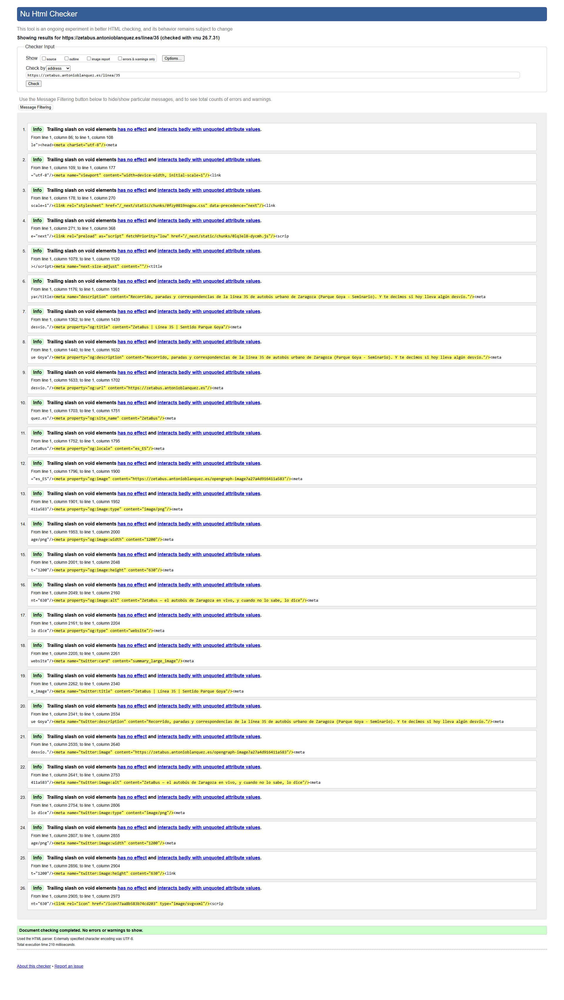
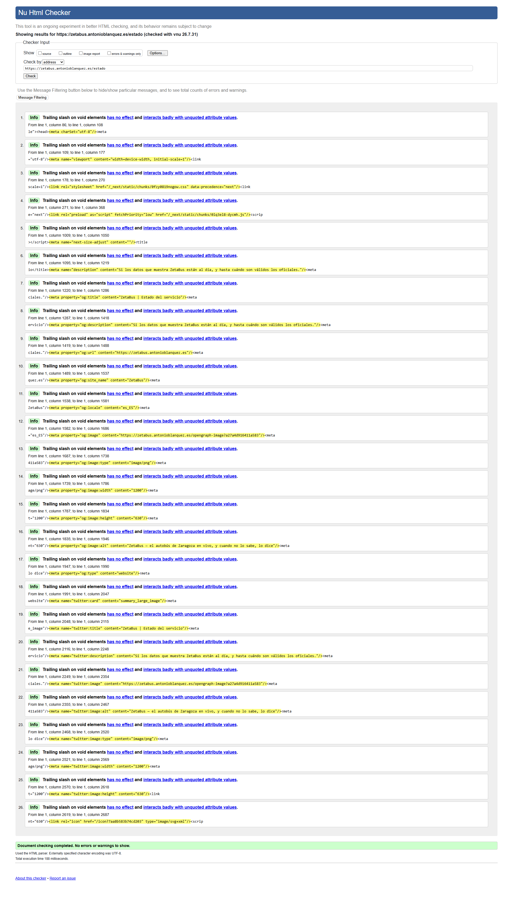
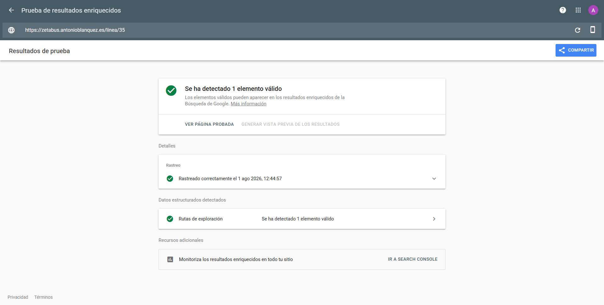

# Verificación externa de cierre

> **REGISTRO HISTÓRICO FECHADO.** Este documento recoge la batería de verificación **externa** pasada a
> ZetaBus el **1 de agosto de 2026**, sobre el commit desplegado que se dice abajo. No se reescribe: si
> se vuelve a verificar, se escribe otro. Como los seis informes de bloque de `docs/auditoriafinal/`.

- **Qué es:** la comprobación con **herramientas de terceros** —no con los tests del propio proyecto— de
  que el despliegue de cierre no rompió nada y de que lo arreglado está realmente arreglado **en
  producción**.
- **Fecha:** 2026-08-01.
- **Commit verificado:** `ae14ea9` (`main`), desplegado en `https://zetabus.antonioblanquez.es`.
- **Qué se acababa de desplegar:** **69 commits** (`6967c02..ae14ea9`) — los seis bloques de la auditoría
  de cierre, sus arreglos y sus decisiones.
- **Por qué importa que sea EXTERNA:** los tests del proyecto los escribió el proyecto. Estas siete
  herramientas **no saben qué pretendía ZetaBus**: miden lo que hay. Es la única capa de verificación que
  no comparte los supuestos del código.

---

## 1 · Resumen

**Ninguna nota bajó. Dos páginas pasaron de tener errores a cero.**

| # | Herramienta | Qué mide | Resultado | Referencia previa |
|---|---|---|---|---|
| 1 | **PageSpeed Insights** (escritorio) | Rendimiento · Accesibilidad · Prácticas · SEO | **100 · 96 · 100 · 100** | Igual |
| 2 | **PageSpeed Insights** (móvil) | Lo mismo, con red 4G lenta emulada | **99 · 96 · 100 · 100** | 100 · 96 · 100 · 100 |
| 3 | **Navegación agéntica** (Google) | Si un agente de IA puede navegar el sitio | **2/2** | *categoría nueva* |
| 4 | **securityheaders.com** (Snyk) | Cabeceras HTTP de seguridad | **A+** | Igual |
| 5 | **W3C Nu Html Checker** | Conformidad del HTML — **4 páginas** | **0 errores en las 4** | `/parada` tenía **8**, `/linea` tenía **10** |
| 6 | **Rich Results Test** (Google) | Datos estructurados que Google dibuja | **1 elemento válido** | Igual |

> ⚠️ **El −1 de móvil es ruido de medición, no una regresión.** Las métricas siguen todas en verde: FCP
> 1,1 s · TBT 0 ms · CLS 0 · Speed Index 2,0 s. La puntuación de Rendimiento se calcula de esas métricas
> y oscila un punto entre corridas con red emulada.

---

## 2 · La evidencia, herramienta por herramienta

### 2.1 · PageSpeed Insights — escritorio

`https://zetabus.antonioblanquez.es/` · Informe del 1 ago 2026, 12:40:34 CEST · Lighthouse 13.4.1.

**Qué cubre este ángulo:** velocidad de carga real medida sobre la página desplegada, accesibilidad
automatizable, prácticas de seguridad del navegador y legibilidad para buscadores.

| Métrica | Valor | Umbral "bueno" |
|---|---|---|
| First Contentful Paint | **0,3 s** | < 1,8 s |
| Largest Contentful Paint | **0,3 s** | < 2,5 s |
| Total Blocking Time | **0 ms** | < 200 ms |
| Cumulative Layout Shift | **0** | < 0,1 |
| Speed Index | **0,8 s** | < 3,4 s |

⭐ **El CLS a 0 merece mención**: significa que **nada se mueve de sitio mientras carga**. En una app cuyo
contenido llega del servidor y se refresca solo, es el resultado difícil.

**El 96 de Accesibilidad — declarado, no escondido.** El único punto que resta es *"los colores de fondo y
de primer plano no tienen una relación de contraste adecuada"*, y apunta a los chips de número de línea.
**Está diagnosticado y cerrado como artefacto de medición**, no como deuda: el número es un glifo de **dos
colores** (relleno blanco + trazo negro de 0,7 px con `paint-order: stroke`), y la fórmula de contraste de
WCAG **no sabe evaluar eso** — mide un color contra el fondo, no dos a la vez. Medido sobre las 44 líneas:
`max(blanco, negro) ≥ 4,58` **siempre** (peor caso 4,80), por encima del mínimo AA de 4,5. *Detalle
completo en el bloque B y en la lección L81 del estado del proyecto.*

### 2.2 · PageSpeed Insights — móvil

Mismo informe, pestaña Móvil · Moto G Power emulado · limitación de 4G lenta.

**99 · 96 · 100 · 100.** Métricas: FCP 1,1 s · LCP 2,1 s · TBT 0 ms · CLS 0 · Speed Index 2,0 s.

**Por qué se mira el móvil aparte:** es **el caso de uso real** de ZetaBus — alguien de pie en la calle,
con prisa y con la red del móvil. Que las métricas aguanten con 4G lenta emulada es el escenario que
importa.

### 2.3 · Navegación agéntica — 2/2

Categoría **nueva** de Lighthouse, presente por primera vez en esta ronda.

**Qué mide:** si un agente de IA puede navegar el sitio y operar sobre él correctamente.

⭐ **No se hizo nada para aprobarla** — y ése es el dato interesante. Se pasa de largo porque el proyecto
ya tenía lo que un agente necesita: **HTML semántico**, **un solo `<h1>` por página**, **landmarks
reales**, y **datos estructurados**. Lo que se hizo por accesibilidad y por honestidad resultó ser también
lo que hace el sitio legible para una máquina.

### 2.4 · securityheaders.com — A+

`https://zetabus.antonioblanquez.es/` · 01 Aug 2026 10:42:16 UTC.

**Qué cubre este ángulo:** las cabeceras HTTP que el navegador usa para defender al usuario. **No** mira
el código: mira lo que el servidor promete.

| Cabecera | Valor | Contra qué protege |
|---|---|---|
| `Strict-Transport-Security` | `max-age=31536000; includeSubDomains` | Degradación a HTTP |
| `X-Frame-Options` | `SAMEORIGIN` | *Clickjacking* |
| `X-Content-Type-Options` | `nosniff` | Adivinación de tipo MIME |
| `Referrer-Policy` | `strict-origin-when-cross-origin` | Fuga de URL al navegar fuera |
| `Permissions-Policy` | `camera=(), microphone=(), geolocation=()` | Uso de APIs que la app no necesita |
| `Content-Security-Policy` | `upgrade-insecure-requests` | Contenido mixto |

⚠️ **Con honestidad sobre el alcance:** la `Content-Security-Policy` es **mínima** (solo fuerza HTTPS), no
una política estricta de orígenes. **Fue una decisión, no un olvido:** una CSP estricta rompe el mapa
(Leaflet carga teselas de OpenStreetMap) y la ganancia real en un sitio sin autenticación ni datos de
usuario no compensaba el riesgo de romper la funcionalidad principal. **La A+ no significa "blindado":
significa que las cabeceras que hay están bien puestas.**

### 2.5 · W3C Nu Html Checker — cuatro páginas, cero errores

Validador oficial del W3C (`vnu 26.7.31`).

| Página | Antes | Ahora |
|---|---|---|
| `/` | 0 errores | ✅ **0** |
| `/parada/744` | **8 errores** | ✅ **0** |
| `/linea/35` | **10 errores** | ✅ **0** |
| `/estado` | 0 errores | ✅ **0** |

Las cuatro terminan en *"Document checking completed. **No errors or warnings to show.**"*

⭐ **Por qué se validan CUATRO páginas y no una.** En la primera ronda se validó **solo la home** y salió
limpia — de donde se concluyó, mal, que el HTML del sitio estaba bien. Al validar `/linea/35` aparecieron
**10 errores**; al validar `/parada/744`, **8 más**. **Cada tipo de página tiene su propio marcado**, y
validar una sola no dice nada de las demás. Es una lección de método que este documento aplica.

**Qué eran esos errores, y por qué no eran cosméticos:**

- **`/parada` · 8× `
` dentro de `<button>`** — un `<button>` solo admite contenido de frase. **No
  está definido por la especificación**, así que cada navegador y cada tecnología de asistencia decide
  por su cuenta qué hacer con él: funcionaba **por convención, no por contrato**.
  ⚠️ **Se arregló convirtiendo los `
` en `` con las mismas clases** — y **no** con la vía
  aparentemente más fácil (`
`), que habría dado HTML válido y **menos accesible**:
  perdería el foco nativo, la activación con Enter y Espacio, y el comportamiento en móvil. *Mejorar la
  nota empeorando justo lo que la nota mide.* Verificado tras el cambio: la tarjeta sigue respondiendo a
  ratón, **Enter y Espacio**, con el mismo nombre accesible.

- **`/linea` · 10× `aria-label` en `` sin `role`** — lo grave no era la invalidez: **es que la
  etiqueta no se oía**. Un `` sin `role` es genérico, y los lectores de pantalla **ignoran** el
  `aria-label` en genéricos. Alguien puso *"04:40, sale de P. Mina, no de Seminario"* para que un usuario
  ciego lo oyera, **y no lo oía**. Un instrumento que parece informar y no informa.

⚠️ **Los bloques amarillos "Info" NO son errores.** Aparecen ~26 por página y dicen *"Trailing slash on
void elements"*: es la barra final que **React genera** en `<meta …/>`. El propio validador **los excluye
del recuento** y termina en verde. Se dice aquí porque **la impresión visual de una pantalla llena de
amarillo asusta**, y quedarse con la impresión en vez del veredicto sería un susto falso.

### 2.6 · Rich Results Test — 1 elemento válido

`https://zetabus.antonioblanquez.es/linea/35` · rastreado el 1 ago 2026, 12:44:57.

**Datos estructurados detectados: Rutas de exploración — 1 elemento válido.**

**Qué cubre este ángulo:** si Google entiende la estructura del sitio lo bastante como para **dibujar**
algo enriquecido en sus resultados.

⭐ **Y el contexto explica por qué solo hay uno.** Se estudió marcar el sitio con los esquemas de
transporte (`BusStop`, `BusTrip`, `GeoCoordinates`) — parecía lo natural para una app de autobuses. **Se
descartó, con evidencia:**

1. **Esos tipos NO están en el catálogo de resultados enriquecidos de Google.** Los entiende, pero **no
   dibuja nada visible** con ellos. Aunque se marcaran las 934 paradas, esta prueba seguiría diciendo "no
   se ha detectado ningún elemento".
2. **`/parada/*` está bloqueada en `robots.txt` a propósito**, porque lo único valioso de una parada son
   los minutos que faltan y **caducan en 15 segundos**: indexarla sería publicar una foto vieja. ⇒ **El
   sitio natural del marcado era justo el que el proyecto le dice a Google que no mire.**
3. **Y la honestidad prohibía el resto**: un dato estructurado es una afirmación **sin la interfaz
   alrededor que la matiza**. No hay dónde poner el *"⚠ nombre sin confirmar"*, ni la edad del dato, ni el
   aviso de servicio degradado.

⇒ Sobrevivió **una** pieza: el `BreadcrumbList`. Es verdad, Google **sí** la dibuja, va en páginas
indexables, y **no se pudre** (se deriva del identificador de la línea en cada render).

⚠️ Y **dos trampas descartadas a propósito**: `FAQPage` (inventar una sección de preguntas frecuentes que
no existe, solo para conseguir una ficha vistosa) y `SearchAction` (deprecado por Google, y el buscador de
ZetaBus es de cliente: declararlo habría sido mentir). **Ninguna se hizo.**

---

## 3 · ⚠️ Qué NO cubren estas pruebas

**Ocho verdes seguidos invitan a concluir de más.** Esta sección existe para que no ocurra.

**Ninguna de estas siete herramientas comprueba si la app dice la verdad sobre los autobuses.** Miden la
**forma** —velocidad, marcado, cabeceras, estructura—, no el **fondo**. Una aplicación que inventara los
minutos de llegada sacaría exactamente estas mismas notas.

Concretamente, **queda fuera de esta batería**:

| Ángulo | Quién lo cubre |
|---|---|
| Que los datos mostrados sean correctos | Los contadores de control del build (esperado vs obtenido) y la suite del proyecto |
| Que la app **distinga "no hay nada" de "no lo sé"** — su tesis | El bloque F (recorrido de usuario) y los guardianes |
| Que los tests **prueben lo que dicen probar** | El bloque C, auditado **por mutación**: romper lo vigilado y comprobar que salta |
| Que el código no tenga deuda oculta | El bloque A |
| Que la operación (build, cron, datos) sea reproducible | El bloque E |
| Que la documentación no mienta | El bloque D |
| **Que se ENTIENDA** | **Nadie automáticamente.** Por eso la página se abre y se mira |

⚠️ **Y tres límites concretos de estas mismas herramientas:**

- **Lighthouse detecta un subconjunto de los problemas de accesibilidad**, y lo dice él mismo. El 96 no
  significa "accesible": significa "sin fallos de los que esta herramienta sabe detectar". La navegación
  por teclado, el orden de foco y la comprensibilidad se comprobaron **a mano**, en el bloque B.
- **El validador del W3C mide conformidad, no calidad.** Un HTML válido puede ser incomprensible.
- **`securityheaders.com` mira cabeceras, no código.** No dice nada de inyección, de autorización ni de
  cómo se tratan los datos de terceros — eso se auditó en el bloque A.

---

## 4 · Contexto: qué se acababa de desplegar

Esta ronda **no es una foto inicial: es una comprobación de regresión** tras el mayor lote de cambios del
proyecto. Entre otros: el orden del pipeline de build, la caché del recorrido, la fuente única de la
versión, los mensajes de error (se les quitó la jerga técnica), el suelo de zona táctil, el marcado de los
botones de llegada, los `aria-label`, el ancho del panel de estado, dos enlaces nuevos en el pie, el
`BreadcrumbList`, y el arreglo de la pantalla de error.

⭐ **El valor de pasar la batería el MISMO día del despliegue:** si una nota hubiera bajado, se sabría cuál
de los 69 commits fue. Una semana después, no.

**Y el build confirmó, de paso, el arreglo más importante del lote:** el paso de versión corrió **el
primero**, así que la capa de nombres encontró lo que necesitaba y se generó completa — **918 de 934
paradas con nombre del operador (98%)**. En el despliegue anterior ese mismo paso fallaba y **las 934
salían marcadas como "nombre sin confirmar"**.

---

## 5 · Verificación manual complementaria

Además de las herramientas, se abrió el sitio y se comprobó a mano:

- **Home** — la línea *"El autobús urbano de Zaragoza, línea a línea"* aparece arriba. *(Antes la ciudad
  solo estaba en el pie y en un `<h1>` visualmente oculto: quien llegaba de nuevas no sabía de qué ciudad
  eran los autobuses.)*
- **Pie** — los cuatro enlaces, con "Estado del servicio" y "Código" nuevos. *(Antes no había camino del
  sitio al código, ni a la pantalla de transparencia.)*
- **`/estado`** — el panel de cuatro tarjetas **usa el ancho** en escritorio. *(Era una columna estrecha
  de 640 px con la pantalla vacía a los lados, en un panel de datos.)*
- **`/parada/744`** — nombre confirmado, sin aviso, y llegadas actualizándose.
- **`/linea/35`** — recorrido correcto.

---

## 6 · Cómo repetir esta verificación

1. **PageSpeed Insights** — `pagespeed.web.dev`, con la URL de la home. **Mirar las dos pestañas**
   (Móvil y Ordenador): dan notas distintas.
2. **securityheaders.com** — con el dominio.
3. **W3C Nu Html Checker** — `validator.w3.org`, y ⚠️ **con VARIAS páginas**: al menos la home, una
   parada, una línea y el panel de estado. Ignorar los "Info" amarillos; mirar el veredicto final.
4. **Rich Results Test** — `search.google.com/test/rich-results`, con la URL de **una línea** (es donde
   vive el marcado).

⚠️ **Hacerlo el mismo día del despliegue**, y **antes de acumular más cambios**: si algo se mueve, hay
que poder atribuirlo.
